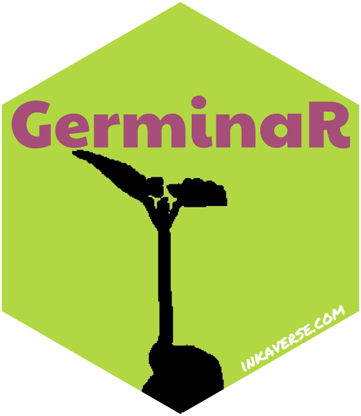

# GerminaR 

<!-- badges: start -->

[](https://CRAN.R-project.org/package=GerminaR)
[](https://doi.org/10.5281/zenodo.17417782)
[](https://github.com/flavjack/GerminaR/actions/workflows/R-CMD-check.yaml)
[](https://r-pkg.org/pkg/GerminaR)
<!-- badges: end -->

GerminaR is a platform base in open source R package to calculate and
graphic the main germination indices. GerminaR include a web application
called “GerminQuant for R” for interactive analysis.

## Installation

You can install the released version of GerminaR from
[CRAN](https://cran.r-project.org/package=GerminaR) with:

``` r
install.packages("GerminaR")
```

And the development version from
[GitHub](https://github.com/flavjack/GerminaR) with:

``` r
if (!require("remotes"))
  install.packages("remotes")
remotes::install_github("Flavjack/GerminaR")
```

## GerminaQuant app

``` r
GerminaR::GerminaQuant()
```

If is the first time running the app you should install the app
dependencies, including the following argument:

``` r
GerminaR::GerminaQuant(dependencies = TRUE)
```

After install the package and the app dependencies you can access to the
app through the Addins list in Rstudio, or in the following link in the
internet <https://inkaverse.shinyapps.io/germinaquant/>

## Citation

Lozano-Isla, Flavio; Benites-Alfaro, Omar Eduardo; Pompelli, Marcelo
Francisco (2019). GerminaR: An R package for germination analysis with
the interactive web application “GerminaQuant for R.” Ecological
Research, 34(2), 339–346. <https://doi.org/10.1111/1440-1703.1275>
