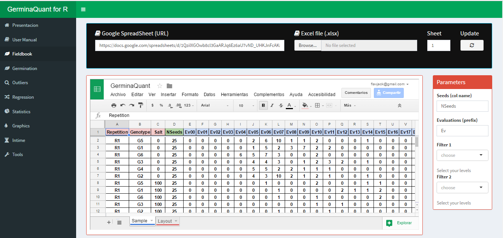
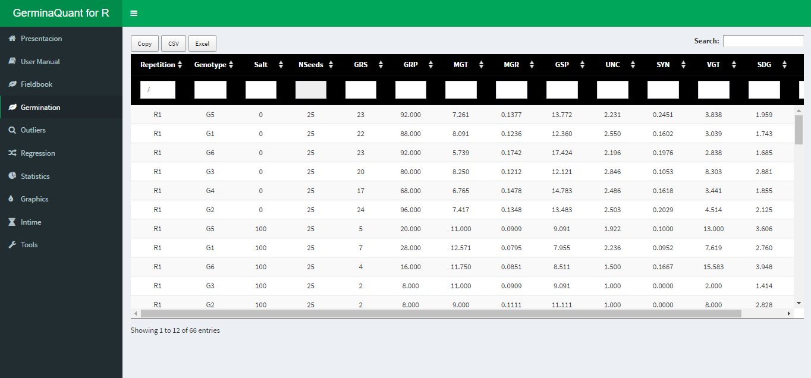
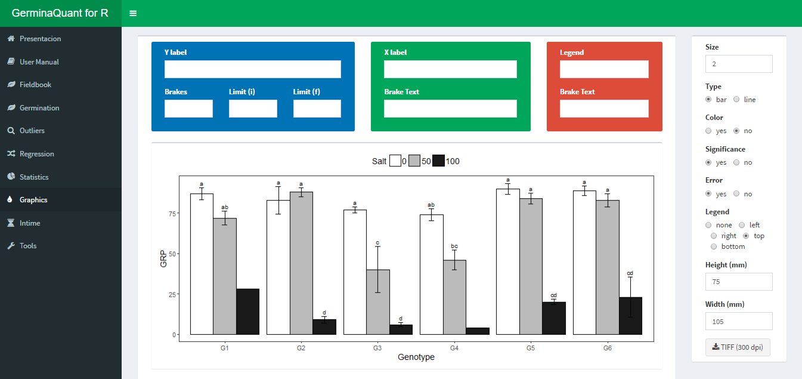
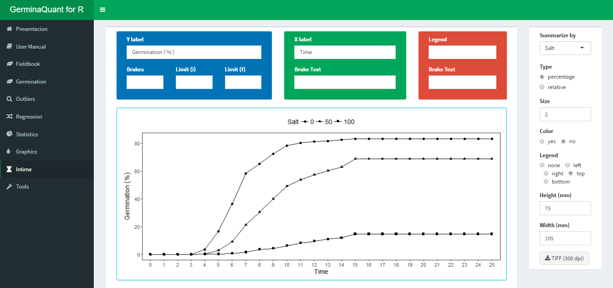

# GerminaQuant

**GerminaQuant for R** allows make the calculations for germination
indices incredibly easy in an interactive web applications build in R
([R Core Team, 2025](#ref-R-base)), based in `GerminaR`
([**R-GerminaR?**](#ref-R-GerminaR)) and `Shiny` R package ([Chang et
al., 2024](#ref-R-shiny)). GerminaQuant app is reactive!. Outputs change
instantly as users modify inputs. The principal features of the
application allows to calculate the main germination indices,
statistical analysis and easy way to plot the results.

Demo

GerminaQuant

## App modules

The application is compound for different tabs that allow to make the
analysis very easy.

| Module | Description |
|:---|:---|
| Presentation | Presentation of the package and the application with their principal characteristics and information |
| Fieldbook | Interface to upload the data from germination data and choose the parameter for the analysis. Allows to upload the data from google sheet or excel file |
| Germination | Table with the indices calculated from the germination data |
| Exploratory | Interface to explore your data and their distribution using boxplot graphics |
| Statistics | Interface to perform the statistical análisis according the experimental design. Allows to calculate the analysis of variance, summary statistics, mean comparison table and model diagnostic |
| Graphics | Plot the mean comparison table from the `Statistics` module. Allows to customized the results using bar or line plot |
| InTime | Plot the germination process in time selecting one of the factor from your experiment. Allows to customized the results using line plot |
| Tools | Tool for calculate the osmotic potential for any salt or PEG solution |

Description of each module in GerminaQuant to evaluate and analyze the
germination process.

## Data processing

### Fieldbook

When you have your fieldbook, you can access to the app [GerminaQuant
for R](https://flavjack.shinyapps.io/germinaquant/) and go “Fieldbook”
tab.

Fieldbook interface for import your data

You can paste a Google spread sheet URL or upload a local file in xlsx
format. In “Seeds (col name)” you have to write the name of the column
containing the information of the number of seed sown in each
experimental unit, for “Evaluations (prefix)” you have to put the prefix
of the names for the evaluated days from the germination time lapse.

### Germination

If the parameter in the “Fieldbook” tab are correct, in “Germination”
tab will be performed and the values of the germination indices will be
shown maintaining the experimental design. GerminaQuant allows to copy
or downloading the information in “csv” or “xlsx” format.

Dowload option for the calculated variables

### Statistics

The GerminaQuant application can perform analysis for experimental
design in a Complete Randomize Design (CRD), Randomize Complete Block
Design (RCBD), Latin Square Design (LSD) or factorial designs, allowing
calculate the analysis of variance (AOV) and the mean differences
through Student Newman Keuls (SNK), Tukey or Duncan test.

Statitical analysis with ANOVA and mean comparison test

### Graphics

Automatically after performed the statistical analysis the application
will generate the graphs for the variable chosen with the mean
comparison test. The app interface allows customized the graphics in a
bar or line plot and export in “tiff” format for publication quality.

Customized interface for bar or line plot

### InTime

This Tab allows to visualize the germination process according one of
the experimental factors. The app interface allows customized the
graphic.

Germination in time plot

The application allows to plot two type of graphics, the first is the
germination percentage in time lapse, and the second the relative
germination that calculates the germination according the total number
of germinated seeds.

## References

Chang, W., Cheng, J., Allaire, J., Sievert, C., Schloerke, B., Xie, Y.,
Allen, J., McPherson, J., Dipert, A., & Borges, B. (2024). *Shiny: Web
application framework for r*. <https://shiny.posit.co/>

R Core Team. (2025). *R: A language and environment for statistical
computing*. R Foundation for Statistical Computing.
<https://www.R-project.org/>
