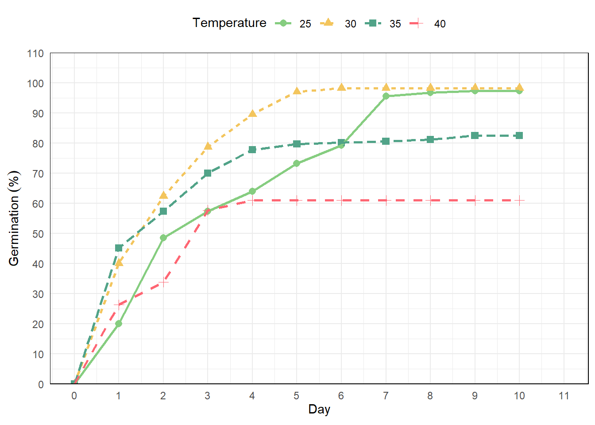

# GerminaR

GerminaR is a platform base in open source package to calculate and
graphic the main germination indices in R. GerminaR include a web
application called “GerminQuant for R” for interactive analysis.

[](https://CRAN.R-project.org/package=GerminaR)
GerminaR

[](https://germinar.inkaverse.com/)
Project

Analysis for the germination experiment can follow a routine. The
functions will de explain according to the data set included in the
GerminaR package: “*prosopis*”.

1.  Install and load the GerminaR package. Load the “*prosopis*” dataset
    on your session. In case of using another dataset, you can load your
    own data and proceed according to the following script:

``` r
# Install packages and dependencies

library(GerminaR)

# load data

fb <- prosopis

# Prosopis data set

fb %>% 
   head(10) %>% 
   kable(caption = "Prosopis dataset")
```

| rep | nacl | temp | seeds |  D0 |  D1 |  D2 |  D3 |  D4 |  D5 |  D6 |  D7 |  D8 |  D9 | D10 |
|----:|-----:|-----:|------:|----:|----:|----:|----:|----:|----:|----:|----:|----:|----:|----:|
|   1 |  0.0 |   25 |    50 |   0 |  39 |   8 |   3 |   0 |   0 |   0 |   0 |   0 |   0 |   0 |
|   2 |  0.0 |   25 |    50 |   0 |  40 |   9 |   1 |   0 |   0 |   0 |   0 |   0 |   0 |   0 |
|   3 |  0.0 |   25 |    50 |   0 |  34 |  16 |   0 |   0 |   0 |   0 |   0 |   0 |   0 |   0 |
|   4 |  0.0 |   25 |    50 |   0 |  43 |   7 |   0 |   0 |   0 |   0 |   0 |   0 |   0 |   0 |
|   1 |  0.0 |   30 |    50 |   0 |  48 |   2 |   0 |   0 |   0 |   0 |   0 |   0 |   0 |   0 |
|   2 |  0.0 |   30 |    50 |   0 |  47 |   3 |   0 |   0 |   0 |   0 |   0 |   0 |   0 |   0 |
|   3 |  0.0 |   30 |    50 |   0 |  50 |   0 |   0 |   0 |   0 |   0 |   0 |   0 |   0 |   0 |
|   4 |  0.0 |   30 |    50 |   0 |  49 |   1 |   0 |   0 |   0 |   0 |   0 |   0 |   0 |   0 |
|   1 |  0.5 |   25 |    50 |   0 |  10 |  37 |   1 |   2 |   0 |   0 |   0 |   0 |   0 |   0 |
|   2 |  0.5 |   25 |    50 |   0 |  18 |  30 |   1 |   1 |   0 |   0 |   0 |   0 |   0 |   0 |

Prosopis dataset

2.  Calculate the germination indices and perform the ANOVA and the mean
    comparison tests. The user can generate the graphs, expressing their
    results, which can be either of bars or lines graphics.

``` r

# germination analysis (ten variables)

gsm <- ger_summary(factors = c("rep", "nacl", "temp")
                   , SeedN = "seeds"
                   , evalName = "D"
                   , cumulative = FALSE
                   , data = fb
                   )

# Prosopis data set processed

gsm %>% 
  head(10) %>% 
  mutate(across(where(is.numeric), ~round(., 2))) %>% 
  kable(caption = "Function ger_summary performe ten germination indices")
```

| rep | nacl | temp | seeds | grs | grp |  mgt |  mgr |    gsp |  unc |  syn |  vgt |  sdg |   cvg |
|:----|:-----|:-----|------:|----:|----:|-----:|-----:|-------:|-----:|-----:|-----:|-----:|------:|
| 1   | 0    | 25   |    50 |  50 | 100 | 1.28 | 0.78 |  78.12 | 0.95 | 0.63 | 0.33 | 0.57 | 44.75 |
| 2   | 0    | 25   |    50 |  50 | 100 | 1.22 | 0.82 |  81.97 | 0.82 | 0.67 | 0.22 | 0.46 | 38.09 |
| 3   | 0    | 25   |    50 |  50 | 100 | 1.32 | 0.76 |  75.76 | 0.90 | 0.56 | 0.22 | 0.47 | 35.70 |
| 4   | 0    | 25   |    50 |  50 | 100 | 1.14 | 0.88 |  87.72 | 0.58 | 0.75 | 0.12 | 0.35 | 30.75 |
| 1   | 0    | 30   |    50 |  50 | 100 | 1.04 | 0.96 |  96.15 | 0.24 | 0.92 | 0.04 | 0.20 | 19.03 |
| 2   | 0    | 30   |    50 |  50 | 100 | 1.06 | 0.94 |  94.34 | 0.33 | 0.88 | 0.06 | 0.24 | 22.63 |
| 3   | 0    | 30   |    50 |  50 | 100 | 1.00 | 1.00 | 100.00 | 0.00 | 1.00 | 0.00 | 0.00 |  0.00 |
| 4   | 0    | 30   |    50 |  50 | 100 | 1.02 | 0.98 |  98.04 | 0.14 | 0.96 | 0.02 | 0.14 | 13.86 |
| 1   | 0.5  | 25   |    50 |  50 | 100 | 1.90 | 0.53 |  52.63 | 1.08 | 0.58 | 0.38 | 0.61 | 32.34 |
| 2   | 0.5  | 25   |    50 |  50 | 100 | 1.70 | 0.59 |  58.82 | 1.20 | 0.48 | 0.38 | 0.61 | 36.14 |

Function ger_summary performe ten germination indices

## Punctual analysis of germination

### Germination percentage

``` r

## Germination Percentage (GRP)

# analysis of variance

av <- aov(grp ~ nacl*temp + rep, data = gsm)

# mean comparison test

mc_grp <- ger_testcomp(aov = av
                       , comp = c("temp", "nacl")
                       , type = "snk"
                       )

# data result

mc_grp$table %>% 
   kable(caption = "Germination percentage mean comparision")
```

| temp | nacl |   grp |      std |   r |       ste |        se | min | max | sig |
|:-----|:-----|------:|---------:|----:|----------:|----------:|----:|----:|:----|
| 25   | 0    | 100.0 | 0.000000 |   4 | 0.0000000 | 0.8413648 | 100 | 100 | a   |
| 25   | 0.5  | 100.0 | 0.000000 |   4 | 0.0000000 | 0.8413648 | 100 | 100 | a   |
| 25   | 1    |  96.0 | 1.632993 |   4 | 0.8164966 | 0.8413648 |  94 |  98 | abc |
| 25   | 1.5  |  96.0 | 1.632993 |   4 | 0.8164966 | 0.8413648 |  94 |  98 | abc |
| 25   | 2    |  94.5 | 2.516611 |   4 | 1.2583057 | 0.8413648 |  92 |  98 | bc  |
| 30   | 0    | 100.0 | 0.000000 |   4 | 0.0000000 | 0.8413648 | 100 | 100 | a   |
| 30   | 0.5  | 100.0 | 0.000000 |   4 | 0.0000000 | 0.8413648 | 100 | 100 | a   |
| 30   | 1    |  98.5 | 1.914854 |   4 | 0.9574271 | 0.8413648 |  96 | 100 | a   |
| 30   | 1.5  |  98.5 | 3.000000 |   4 | 1.5000000 | 0.8413648 |  94 | 100 | a   |
| 30   | 2    |  94.0 | 1.632993 |   4 | 0.8164966 | 0.8413648 |  92 |  96 | c   |
| 35   | 0    | 100.0 | 0.000000 |   4 | 0.0000000 | 0.8413648 | 100 | 100 | a   |
| 35   | 0.5  |  98.0 | 2.309401 |   4 | 1.1547005 | 0.8413648 |  96 | 100 | ab  |
| 35   | 1    |  96.0 | 2.828427 |   4 | 1.4142136 | 0.8413648 |  92 |  98 | abc |
| 35   | 1.5  |  98.5 | 1.914854 |   4 | 0.9574271 | 0.8413648 |  96 | 100 | a   |
| 35   | 2    |  20.0 | 1.632993 |   4 | 0.8164966 | 0.8413648 |  18 |  22 | d   |
| 40   | 0    | 100.0 | 0.000000 |   4 | 0.0000000 | 0.8413648 | 100 | 100 | a   |
| 40   | 0.5  |  96.0 | 1.632993 |   4 | 0.8164966 | 0.8413648 |  94 |  98 | abc |
| 40   | 1    |  98.5 | 1.914854 |   4 | 0.9574271 | 0.8413648 |  96 | 100 | a   |
| 40   | 1.5  |  10.5 | 1.914854 |   4 | 0.9574271 | 0.8413648 |   8 |  12 | e   |
| 40   | 2    |   0.0 | 0.000000 |   4 | 0.0000000 | 0.8413648 |   0 |   0 | f   |

Germination percentage mean comparision

``` r

# bar graphics for germination percentage

grp <- mc_grp$table %>% 
   fplot(data = .
       , type = "bar"
       , x = "temp"
       , y = "grp"
       , group = "nacl"
       , ylimits = c(0, 140, 30)
       , ylab = "Germination ('%')"
       , xlab = "Temperature"
       , glab = "NaCl (MPa)"
       , error = "ste"
       , sig = "sig"
       , color = F
       )

grp
```


Germination experiment with *Prosopis juliflor* under different osmotic
potentials and temperatures. Bar graph with germination percentage in a
factorial analisys

### Mean germination time

``` r

## Mean Germination Time (MGT)

# analysis of variance

av <- aov(mgt ~ nacl*temp + rep, data = gsm)

# mean comparison test

mc_mgt <- ger_testcomp(aov = av
                       , comp = c("temp", "nacl")
                       , type = "snk")

# data result

mc_mgt$table %>% 
   kable(caption = "Mean germination time comparison")
```

| temp | nacl |      mgt |       std |   r |       ste |       se |      min |      max | sig |
|:-----|:-----|---------:|----------:|----:|----------:|---------:|---------:|---------:|:----|
| 25   | 0    | 1.240000 | 0.0783156 |   4 | 0.0391578 | 0.073785 | 1.140000 | 1.320000 | j   |
| 25   | 0.5  | 1.830000 | 0.0901850 |   4 | 0.0450925 | 0.073785 | 1.700000 | 1.900000 | i   |
| 25   | 1    | 2.701218 | 0.1512339 |   4 | 0.0756169 | 0.073785 | 2.531915 | 2.897959 | g   |
| 25   | 1.5  | 5.442365 | 0.0415525 |   4 | 0.0207763 | 0.073785 | 5.382979 | 5.479167 | c   |
| 25   | 2    | 6.523349 | 0.3068542 |   4 | 0.1534271 | 0.073785 | 6.063830 | 6.695652 | b   |
| 30   | 0    | 1.030000 | 0.0258199 |   4 | 0.0129099 | 0.073785 | 1.000000 | 1.060000 | j   |
| 30   | 0.5  | 1.100000 | 0.0432049 |   4 | 0.0216025 | 0.073785 | 1.060000 | 1.160000 | j   |
| 30   | 1    | 1.898129 | 0.0609184 |   4 | 0.0304592 | 0.073785 | 1.833333 | 1.959184 | i   |
| 30   | 1.5  | 2.994362 | 0.1138473 |   4 | 0.0569236 | 0.073785 | 2.900000 | 3.160000 | f   |
| 30   | 2    | 4.388259 | 0.0676715 |   4 | 0.0338357 | 0.073785 | 4.326087 | 4.446809 | d   |
| 35   | 0    | 1.015000 | 0.0191485 |   4 | 0.0095743 | 0.073785 | 1.000000 | 1.040000 | j   |
| 35   | 0.5  | 1.076250 | 0.0291905 |   4 | 0.0145952 | 0.073785 | 1.060000 | 1.120000 | j   |
| 35   | 1    | 1.817607 | 0.2398098 |   4 | 0.1199049 | 0.073785 | 1.653061 | 2.173913 | i   |
| 35   | 1.5  | 3.370480 | 0.0159689 |   4 | 0.0079844 | 0.073785 | 3.354167 | 3.387755 | e   |
| 35   | 2    | 6.984343 | 0.3784214 |   4 | 0.1892107 | 0.073785 | 6.555556 | 7.400000 | a   |
| 40   | 0    | 1.035000 | 0.0191485 |   4 | 0.0095743 | 0.073785 | 1.020000 | 1.060000 | j   |
| 40   | 0.5  | 2.327648 | 0.0512449 |   4 | 0.0256225 | 0.073785 | 2.255319 | 2.375000 | h   |
| 40   | 1    | 2.728780 | 0.1714562 |   4 | 0.0857281 | 0.073785 | 2.520833 | 2.940000 | g   |
| 40   | 1.5  | 3.287500 | 0.1012651 |   4 | 0.0506326 | 0.073785 | 3.166667 | 3.400000 | e   |

Mean germination time comparison

``` r

# bar graphics for mean germination time

mgt <- mc_mgt$table %>% 
   fplot(data = .
       , type = "bar" 
       , x = "temp"
       , y = "mgt"
       , group = "nacl"
       , ylimits = c(0,10, 1)
       , ylab = "Mean germination time (days)"
       , xlab = "Temperature"
       , glab = "NaCl (MPa)"
       , sig = "sig"
       , error = "ste"
       , color = T
       )

mgt
```


Germination experiment with *Prosopis juliflor* under different osmotic
potentials and temperatures. Bar graph for mean germination time in a
factorial analisys.

> You can add at each plot different arguments as the standard error,
> significance of the mean test, color, labels and limits. The resulted
> graphics are performed for publications and allows to insert math
> expression in the titles.

## Cumulative analysis of germination

The cumulative analysis of the germination allows to observe the
evolution of the germination process, being able to be expressed as the
percentage of germination or with the relative germination.

### In time analysis for NaCl

``` r

# data frame with percentage or relative germination in time by NaCl

git <- ger_intime(Factor = "nacl"
                  , SeedN = "seeds"
                  , evalName = "D"
                  , method = "percentage"
                  , data = fb
                  )

# data result

git %>% 
   head(10) %>% 
   kable(caption = "Cumulative germination by nacl factor")
```

| nacl | evaluation |   mean |   r |        std | min | max |       ste |
|:-----|-----------:|-------:|----:|-----------:|----:|----:|----------:|
| 0    |          0 |  0.000 |  16 |  0.0000000 |   0 |   0 | 0.0000000 |
| 0.5  |          0 |  0.000 |  16 |  0.0000000 |   0 |   0 | 0.0000000 |
| 1    |          0 |  0.000 |  16 |  0.0000000 |   0 |   0 | 0.0000000 |
| 1.5  |          0 |  0.000 |  16 |  0.0000000 |   0 |   0 | 0.0000000 |
| 2    |          0 |  0.000 |  16 |  0.0000000 |   0 |   0 | 0.0000000 |
| 0    |          1 | 92.500 |  16 |  9.4516313 |  68 | 100 | 2.3629078 |
| 0.5  |          1 | 57.250 |  16 | 35.5818306 |  12 |  96 | 8.8954576 |
| 1    |          1 | 14.500 |  16 | 12.9099445 |   0 |  40 | 3.2274861 |
| 1.5  |          1 |  0.375 |  16 |  0.8062258 |   0 |   2 | 0.2015564 |
| 2    |          1 |  0.000 |  16 |  0.0000000 |   0 |   0 | 0.0000000 |

Cumulative germination by nacl factor

``` r

# graphic germination in time by NaCl

nacl <- git %>% 
   fplot(data = .
        , type = "line"
        , x = "evaluation"
        , y = "mean"
        , group = "nacl"
        , ylimits = c(0, 110, 10)
        , ylab = "Germination ('%')"
        , xlab = "Day"
        , glab = "NaCl (MPa)"
        , color = T
        , error = "ste"
        )
nacl
```


Germination experiment with *Prosopis juliflor* under different osmotic
potentials and temperatures. Line graph from cumulative germination
under different osmotic potentials.

### In time analysis for temperature

``` r

# data frame with percentage or relative germination in time by temperature

git <- ger_intime(Factor = "temp"
                  , SeedN = "seeds"
                  , evalName = "D"
                  , method = "percentage"
                  , data = fb) 

# data result

git %>% 
   head(10) %>% 
   kable(caption = "Cumulative germination by temperature factor")
```

| temp | evaluation | mean |   r |      std | min | max |       ste |
|:-----|-----------:|-----:|----:|---------:|----:|----:|----------:|
| 25   |          0 |  0.0 |  20 |  0.00000 |   0 |   0 |  0.000000 |
| 30   |          0 |  0.0 |  20 |  0.00000 |   0 |   0 |  0.000000 |
| 35   |          0 |  0.0 |  20 |  0.00000 |   0 |   0 |  0.000000 |
| 40   |          0 |  0.0 |  20 |  0.00000 |   0 |   0 |  0.000000 |
| 25   |          1 | 20.1 |  20 | 31.25094 |   0 |  86 |  6.987922 |
| 30   |          1 | 40.1 |  20 | 45.10327 |   0 | 100 | 10.085399 |
| 35   |          1 | 45.2 |  20 | 44.09750 |   0 | 100 |  9.860501 |
| 40   |          1 | 26.3 |  20 | 37.31671 |   0 |  98 |  8.344270 |
| 25   |          2 | 48.6 |  20 | 45.07818 |   0 | 100 | 10.079787 |
| 30   |          2 | 62.4 |  20 | 45.70662 |   0 | 100 | 10.220310 |

Cumulative germination by temperature factor

``` r

# graphic germination in time by temperature

temp <- git %>% 
   fplot(data = .
        , type = "line"
        , x = "evaluation"
        , y = "mean"
        , group = "temp"
        , ylimits = c(0, 110, 10)
        , ylab = "Germination ('%')"
        , xlab = "Day"
        , glab = "Temperature"
        , color = F
        ) 
temp
```


Germination experiment with *Prosopis juliflor* under different osmotic
potentials and temperatures. Line graph from cumulative germination
under different temperatures.

## Using ggplot2

As the function
[`fplot()`](http://germinar.inkaverse.com/reference/fplot.md) is build
using [ggplot2](https://ggplot2.tidyverse.org/) ([Wickham et al.,
2024](#ref-R-ggplot2)). You can add more arguments for modify the
graphics adding `+`.

``` r

library(ggplot2)

git <- ger_intime(Factor = "temp"
                  , SeedN = "seeds"
                  , evalName = "D"
                  , method = "percentage"
                  , data = fb
                  ) 

ggplot <- git %>% 
   fplot(data = .
        , type = "line"
        , x = "evaluation"
        , y = "mean"
        , group = "temp"
        , ylimits = c(0, 110, 10)
        , ylab = "Germination ('%')"
        , xlab = "Day"
        , glab = "Temperature"
        , color = T
        ) +
  scale_x_continuous(n.breaks = 10, limits = c(0, 11)) 

ggplot
```



## References

Wickham, H., Chang, W., Henry, L., Pedersen, T. L., Takahashi, K.,
Wilke, C., Woo, K., Yutani, H., Dunnington, D., & van den Brand, T.
(2024). *ggplot2: Create elegant data visualisations using the grammar
of graphics*. <https://ggplot2.tidyverse.org>
