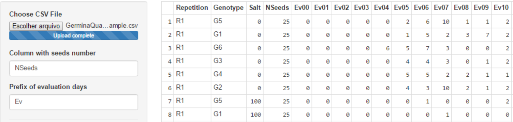
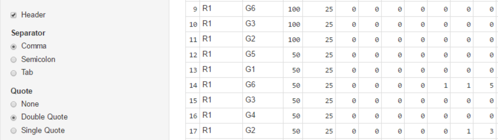
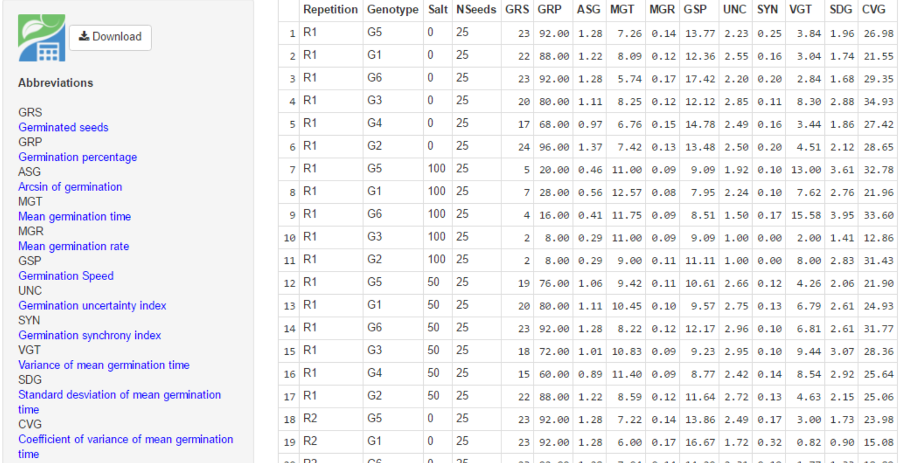
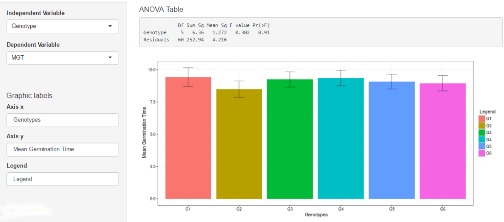
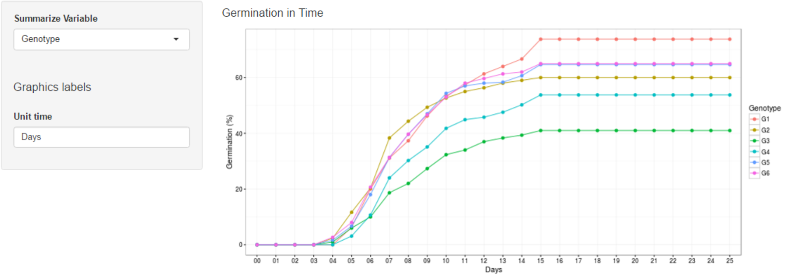

# GerminaQuant data processing

## Field Book

For using the GerminaQuant is necessary that you have a data with germination values. You can use a following data [sample](https://docs.google.com/spreadsheets/d/1QziIXGOwb8cl3GaARJq6Ez6aU7vND_UHKJnFcAKx0VI/edit#gid=667855537). Open the link and download the data in csv format.

Files >> Download >> Comma Separated Values (.csv, current sheet) >> "GerminaQuant - Sample.csv"

If you have a google account you can clone the document for you and edit it online and download for your own analysis.

## Import Data

When you have your field book, you can go [GerminaQuant](https://flavjack.shinyapps.io/germinaquant/) and go "Data Import" tab. Figure \@ref(fig:impdt).

```{r impdt, out.width='100%', fig.cap= "Data Import", fig.align='center', echo=FALSE, include=identical(knitr:::pandoc_to(), 'html')}

```

Choose the file in "csv" format it will be analysed. In "Column with seeds number" you have to write the name of the column containing the information of the number of seed sown in each experimental unit, "Prefix of evaluation days" you have to put the prefix of the name called for the day for evaluate the germination time lapse. 

```{r csv, out.width='100%', fig.cap='Table option for csv format',fig.align='center', echo=FALSE, include=identical(knitr:::pandoc_to(), 'html')}

```

Below of the parameter for evaluation, you will find the option to select the parameter for the "csv" format file. In such way the file should have a table form. Figure \@ref(fig:csv)


## Indices calculation

If the parameter in the "Import Data" tab are correct, in "Germination analysis" tab will be performed and the values of the germination variables for each experimental unit will be show. Table \@ref(tab:varsum). GerminaQuant app allows downloading the file in "csv" format with the calculation of the germination variables. Figure \@ref(fig:dwl)

```{r dwl, out.width='100%',fig.cap='Dowload option for the calculated variables'  ,fig.align='center', echo=FALSE, include=identical(knitr:::pandoc_to(), 'html')}

```

## Statistical analysis

In this tab, the app perform a factorial variance analysis, calculate the statistical description of the factor, the mean differences through Student Newman Keuls [@R-agricolae] and made the graphics [@R-ggplot2] for the chosen variable.

```{r stat, out.width='100%', fig.cap="Statitical analysis with ANOVA and mean comparison test", fig.align='center', echo=FALSE, include=identical(knitr:::pandoc_to(), 'html')}

```

Remember, the independent variables will be the factor in your field book and the dependent variable will be any of the germination variables. Automatically the app will generate the graphs for the variable chosen and give the mean comparison test. The axis label can be edited manually filling the case in the "Graphics labels" section. The bar  and line graphs are represented by the mean and central line is the standard error.

## Germination in Time

This Tab allows to visualize the germination process included in the field book. Figure \@ref(fig:gtime)

```{r gtime, out.width='100%', fig.cap='Germination in time plot', fig.align='center', echo=FALSE, include=identical(knitr:::pandoc_to(), 'html')}

```

The app give two graphics, the first is the germination in percentage in time lapse and the second the relative germination that calculate the germination according the total number of seed germinated.
