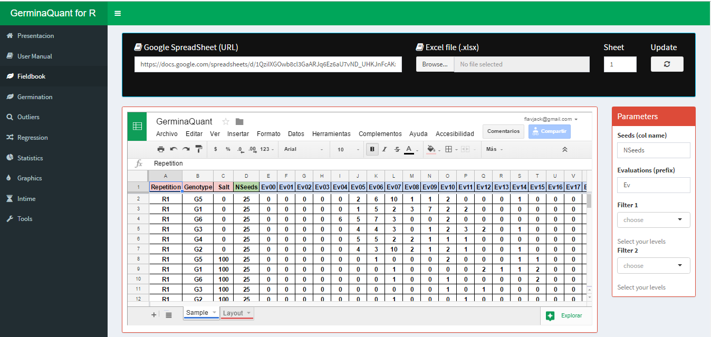

```{r setup, include=FALSE}
source("http://inkaverse.com/docs.r")
```

**GerminaQuant for R** allows make the calculations for germination indices incredibly easy in an interactive web applications build in R [@R-base], based in `GerminaR` [@R-GerminaR] and `Shiny` R package [@R-shiny]. GerminaQuant app is reactive!. Outputs change instantly as users modify inputs. The principal features of the application allows to calculate the principal germination indices, statistical analysis and easy way to plot the results.

```{=html}
<div id=footer style="width:100%; margin:auto;">

<div style="display:inline-block; width:48%">
<p style="text-align:center">
<a target="_blank" href="https://youtube.com/playlist?list=PLSQMdOu57lj9QUoA6JLuv0nBTYacuyrbg"></a> 
<span style="display:block;"><small>Demo</small></span>
</p></div>

<div style="display:inline-block; width:48%">
<p style="text-align:center">
<a target="_blank" href="https://flavjack.shinyapps.io/germinaquant/"></a>
<span style="display:block;"><small>GerminaQuant</small></span>
</p></div>

</div>
```

# App modules

The application is compound for different tabs that allow to make the analysis very easy.

```{r tabs}
tab <- data.frame( 
  
"Tabs" = c(
  
  "Presentation",
  "Fieldbook",
  "Germination",
  "Boxplot",
  "Statistics",
  "Graphics",
  "InTime",
  "Tools"
  
  ),

"Description" = c(
  
  'Presentation of the package and application, principal characteristics and information'
  , "Interface to upload the fieldbook and choose the parameter for the germination analysis. GerminaQuant allows to upload the data from google sheet or excel file"
  , "Calculate automatically the germination variables and export the data file."
  , "Interface to explore your data and their distribution"
  , "Interface to choose the variables according the experimental design for analysis of variance and summarize the information according the principal mean comparison test"
  , "Graphic the mean comparison test for the variables selected in the statistical analysis and plot the information in customized bar or line plot"
  , "Selecting the factor from your experiment, allows plotting the germination process in time."
  , "Tool for calculate the osmotic potential for any salt or PEG for germination experiments"
  )
  
)

knitr::kable(
  tab, 
  booktabs = TRUE,
  caption = 'Name and description of each tab of GerminaQuant to evaluate and analyze the germination process.'
  )
```

# Data processing

## Fieldbook

When you have your fieldbook, you can access to the app [GerminaQuant for R](https://flavjack.shinyapps.io/germinaquant/) and go "Fieldbook" tab.

```{r impdt, out.width='100%', fig.cap= "Fieldbook interface for import your data", fig.align='center'}

```

You can paste a Google spread sheet URL or upload a local file in xlsx format. In "Seeds (col name)" you have to write the name of the column containing the information of the number of seed sown in each experimental unit, for "Evaluations (prefix)" you have to put the prefix of the names for the evaluated days from the germination time lapse. 

## Germination

If the parameter in the "Fieldbook" tab are correct, in "Germination" tab will be performed and the values of the germination indices will be shown maintaining the experimental design. GerminaQuant allows to copy or downloading the information in "csv" or "xlsx" format.

```{r dwl, fig.cap='Dowload option for the calculated variables', fig.align='center',out.width='100%'}
knitr::include_graphics('files/dtdown.png')
```

## Statistical

The GerminaQuant application can perform analysis for experimental design in a Complete Randomize Design (CRD), Randomize Complete Block Design (RCBD), Latin Square Design (LSD) or factorial designs, allowing calculate the analysis of variance (AOV) and the mean differences through Student Newman Keuls (SNK), Tukey or Duncan test.

```{r stat,  fig.cap="Statitical analysis with ANOVA and mean comparison test", fig.align='center', out.width='100%'}
knitr::include_graphics('files/stat.png')
```

## Graphics

Automatically after performed the statistical analysis the application will generate the graphs for the variable chosen with the mean comparison test. The app interface allows customized the graphics in a bar or line plot and export in "tiff" format for publication quality.

```{r plot,  fig.cap="Customized interface for bar or line plot", fig.align='center', out.width='100%'}
knitr::include_graphics('files/plot.png')
```

## InTime

This Tab allows to visualize the germination process according one of the experimental factors. The app interface allows customized the graphic.

```{r gtime,  fig.cap='Germination in time plot', fig.align='center', out.width='100%'}
knitr::include_graphics('files/gtime.png')
```

The application allows to plot two type of graphics, the first is the germination percentage in time lapse, and the second the relative germination that calculates the germination according the total number of germinated seeds.

# References {-}

<div id="refs"></div>

```{r references}
if(!file.exists("files/pkgs.bib")){write_bib(c(.packages()),'files/pkgs.bib')}
```

