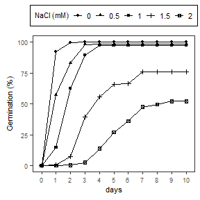

# GerminaR 1.0
Flavio Lozano-Isla, Omar Benites-Alfaro, Denise Garcia de Santana, Marli A. Ranal, Marcelo Francisco Pompelli  
`r Sys.Date()`  


The package `GerminaR` has been developed to calculate different germination indices and graphical functions to analyze punctual and accumulative germination. For calculating the indices is necessary acumulative germination data. For more details, you can read the description of each index, the seed germination dataset and analysis in the germinar's book. ([GerminaQuant](https://flavjack.github.io/GerminaQuant-usm/))


First we load the `GerminaR 1.0` package. It provides the `prosopis` dataset set that we will work throughout all the examples. 


## Data: GerminaR

The `prosopis` dataset contains information from an experiment containing information from germination experiment with *Prosopis juliflor* under different osmotic potentials and temperatures evaluated during 10 days.


```r
library(GerminaR)
dim(prosopis)
```

```
## [1] 80 15
```

```r
str(prosopis)
```

```
## 'data.frame':	80 obs. of  15 variables:
##  $ rep  : int  1 2 3 4 1 2 3 4 1 2 ...
##  $ nacl : num  0 0 0 0 0 0 0 0 0.5 0.5 ...
##  $ temp : int  25 25 25 25 30 30 30 30 25 25 ...
##  $ seeds: int  50 50 50 50 50 50 50 50 50 50 ...
##  $ D0   : int  0 0 0 0 0 0 0 0 0 0 ...
##  $ D1   : int  39 40 34 43 48 47 50 49 10 18 ...
##  $ D2   : int  8 9 16 7 2 3 0 1 37 30 ...
##  $ D3   : int  3 1 0 0 0 0 0 0 1 1 ...
##  $ D4   : int  0 0 0 0 0 0 0 0 2 1 ...
##  $ D5   : int  0 0 0 0 0 0 0 0 0 0 ...
##  $ D6   : int  0 0 0 0 0 0 0 0 0 0 ...
##  $ D7   : int  0 0 0 0 0 0 0 0 0 0 ...
##  $ D8   : int  0 0 0 0 0 0 0 0 0 0 ...
##  $ D9   : int  0 0 0 0 0 0 0 0 0 0 ...
##  $ D10  : int  0 0 0 0 0 0 0 0 0 0 ...
##  - attr(*, "spec")=List of 2
##   ..$ cols   :List of 15
##   .. ..$ rep  : list()
##   .. .. ..- attr(*, "class")= chr  "collector_integer" "collector"
##   .. ..$ nacl : list()
##   .. .. ..- attr(*, "class")= chr  "collector_double" "collector"
##   .. ..$ temp : list()
##   .. .. ..- attr(*, "class")= chr  "collector_integer" "collector"
##   .. ..$ seeds: list()
##   .. .. ..- attr(*, "class")= chr  "collector_integer" "collector"
##   .. ..$ D0   : list()
##   .. .. ..- attr(*, "class")= chr  "collector_integer" "collector"
##   .. ..$ D1   : list()
##   .. .. ..- attr(*, "class")= chr  "collector_integer" "collector"
##   .. ..$ D2   : list()
##   .. .. ..- attr(*, "class")= chr  "collector_integer" "collector"
##   .. ..$ D3   : list()
##   .. .. ..- attr(*, "class")= chr  "collector_integer" "collector"
##   .. ..$ D4   : list()
##   .. .. ..- attr(*, "class")= chr  "collector_integer" "collector"
##   .. ..$ D5   : list()
##   .. .. ..- attr(*, "class")= chr  "collector_integer" "collector"
##   .. ..$ D6   : list()
##   .. .. ..- attr(*, "class")= chr  "collector_integer" "collector"
##   .. ..$ D7   : list()
##   .. .. ..- attr(*, "class")= chr  "collector_integer" "collector"
##   .. ..$ D8   : list()
##   .. .. ..- attr(*, "class")= chr  "collector_integer" "collector"
##   .. ..$ D9   : list()
##   .. .. ..- attr(*, "class")= chr  "collector_integer" "collector"
##   .. ..$ D10  : list()
##   .. .. ..- attr(*, "class")= chr  "collector_integer" "collector"
##   ..$ default: list()
##   .. ..- attr(*, "class")= chr  "collector_guess" "collector"
##   ..- attr(*, "class")= chr "col_spec"
```


## List of the principal functions

* `GerminaQuant`
* `ger_summary`
* `ger_GRS`
* `ger_GRP`
* `ger_ASG`
* `ger_MGT`
* `ger_MGR`
* `ger_GSP`
* `ger_SYN`
* `ger_UNC`
* `ger_SDG`
* `ger_CVG`
* `ger_VGT`
* `ger_intime`
* `fplot` 

## Interactive shiny application

The function`GerminaQuant()` activates an interactive application with friendly interface for performing the different germination, statistical and graphic analysis. For activation of some function could be necessary internet connection


```r
GerminaQuant()
```


## Summary of Germination Variables

The function `ger_summary()`, according to the accumulative germination data, calculates eleven germination indices maintaining the values of each experimental unit and experiments factor for statistical analysis


```r
dt <- prosopis
smr <- ger_summary(SeedN = "seeds", evalName = "D", data = dt)
```

```
## Warning: package 'bindrcpp' was built under R version 3.3.3
```

```r
knitr::kable(head(smr, 10),align = "c")
```


 rep    nacl    temp    seeds    GRS    GRP    MGT        MGR          GSP          UNC          SYN          VGT          SDG         CVG    
-----  ------  ------  -------  -----  -----  ------  -----------  -----------  -----------  -----------  -----------  -----------  ----------
  1     0.0      25      50      50     100    1.28    0.7812500    78.12500     0.9461447    0.6302041    0.3281633    0.5728554    44.75433 
  2     0.0      25      50      50     100    1.22    0.8196721    81.96721     0.8157272    0.6661224    0.2159184    0.4646702    38.08772 
  3     0.0      25      50      50     100    1.32    0.7575758    75.75758     0.9043815    0.5559184    0.2220408    0.4712121    35.69788 
  4     0.0      25      50      50     100    1.14    0.8771930    87.71930     0.5842388    0.7542857    0.1228571    0.3505098    30.74648 
  1     0.0      30      50      50     100    1.04    0.9615385    96.15385     0.2422922    0.9216327    0.0391837    0.1979487    19.03353 
  2     0.0      30      50      50     100    1.06    0.9433962    94.33962     0.3274449    0.8848980    0.0575510    0.2398979    22.63188 
  3     0.0      30      50      50     100    1.00    1.0000000    100.00000    0.0000000    1.0000000    0.0000000    0.0000000    0.00000  
  4     0.0      30      50      50     100    1.02    0.9803922    98.03922     0.1414405    0.9600000    0.0200000    0.1414214    13.86484 
  1     0.5      25      50      50     100    1.90    0.5263158    52.63158     1.0844751    0.5812245    0.3775510    0.6144518    32.33957 
  2     0.5      25      50      50     100    1.70    0.5882353    58.82353     1.1985488    0.4800000    0.3775510    0.6144518    36.14422 


On the other hand, you can analyze each variable independently using the following germination indexes.


## Germinated Seed Number

`ger_GRS()` allows you to calculate the number of seed germinated.


```r
dt <- prosopis
grs <- ger_GRS(evalName = "D", data = dt)
grs
```

```
##  [1] 50 50 50 50 50 50 50 50 50 50 50 50 50 50 50 50 48 48 47 49 49 50 48
## [24] 50 47 48 48 49 50 50 50 47 47 47 46 49 46 48 47 47 50 50 50 50 50 50
## [47] 50 50 50 48 50 48 48 49 48 47 49 48 46 49 50 48 49 50 50 48 50 49  6
## [70]  6  4  5 10 10  9 11  0  0  0  0
```


## Germination Seed Percentage

`ger_GRP()` calculates the germination percentage related at total seed sown for experimental unit.


```r
dt <- prosopis
grp <- ger_GRP(SeedN = "seeds",evalName = "D", data = dt)
grp
```

```
##  [1] 100 100 100 100 100 100 100 100 100 100 100 100 100 100 100 100  96
## [18]  96  94  98  98 100  96 100  94  96  96  98 100 100 100  94  94  94
## [35]  92  98  92  96  94  94 100 100 100 100 100 100 100 100 100  96 100
## [52]  96  96  98  96  94  98  96  92  98 100  96  98 100 100  96 100  98
## [69]  12  12   8  10  20  20  18  22   0   0   0   0
```


## ArcSino of the germination

`ger_ASG()`  calculates the arc sin of germination percentage for normalization.


```r
dt <- prosopis
gas <- ger_ASG(SeedN = "seeds", evalName = "D", data = dt)
gas
```

```
##  [1] 1.5707963 1.5707963 1.5707963 1.5707963 1.5707963 1.5707963 1.5707963
##  [8] 1.5707963 1.5707963 1.5707963 1.5707963 1.5707963 1.5707963 1.5707963
## [15] 1.5707963 1.5707963 1.3694384 1.3694384 1.3233293 1.4288993 1.4288993
## [22] 1.5707963 1.3694384 1.5707963 1.3233293 1.3694384 1.3694384 1.4288993
## [29] 1.5707963 1.5707963 1.5707963 1.3233293 1.3233293 1.3233293 1.2840398
## [36] 1.4288993 1.2840398 1.3694384 1.3233293 1.3233293 1.5707963 1.5707963
## [43] 1.5707963 1.5707963 1.5707963 1.5707963 1.5707963 1.5707963 1.5707963
## [50] 1.3694384 1.5707963 1.3694384 1.3694384 1.4288993 1.3694384 1.3233293
## [57] 1.4288993 1.3694384 1.2840398 1.4288993 1.5707963 1.3694384 1.4288993
## [64] 1.5707963 1.5707963 1.3694384 1.5707963 1.4288993 0.3537416 0.3537416
## [71] 0.2867566 0.3217506 0.4636476 0.4636476 0.4381490 0.4882053 0.0000000
## [78] 0.0000000 0.0000000 0.0000000
```


## Mean Germination Time

`ger_MGT()` estimates the mean germination time according at the time lapse of the evaluations


```r
dt <- prosopis
mgt <- ger_MGT(evalName = "D", data = dt)
mgt
```

```
##  [1] 1.280000 1.220000 1.320000 1.140000 1.040000 1.060000 1.000000
##  [8] 1.020000 1.900000 1.700000 1.880000 1.840000 1.100000 1.160000
## [15] 1.080000 1.060000 2.666667 2.708333 2.531915 2.897959 1.959184
## [22] 1.940000 1.833333 1.860000 5.382979 5.458333 5.479167 5.448980
## [29] 3.160000 2.960000 2.900000 2.957447 6.680851 6.063830 6.695652
## [36] 6.653061 4.326087 4.333333 4.446809 4.446809 1.040000 1.000000
## [43] 1.020000 1.000000 1.060000 1.040000 1.020000 1.020000 1.120000
## [50] 1.062500 1.060000 1.062500 2.333333 2.346939 2.375000 2.255319
## [57] 1.653061 1.729167 2.173913 1.714286 2.940000 2.520833 2.714286
## [64] 2.740000 3.380000 3.354167 3.360000 3.387755 3.333333 3.166667
## [71] 3.250000 3.400000 6.800000 7.400000 6.555556 7.181818      NaN
## [78]      NaN      NaN      NaN
```


## Mean Germination Rate

`ger_MGR()` estimates the mean of germination rate


```r
dt <- prosopis
mgr <- ger_MGR(evalName = "D", data = dt)
mgr
```

```
##  [1] 0.7812500 0.8196721 0.7575758 0.8771930 0.9615385 0.9433962 1.0000000
##  [8] 0.9803922 0.5263158 0.5882353 0.5319149 0.5434783 0.9090909 0.8620690
## [15] 0.9259259 0.9433962 0.3750000 0.3692308 0.3949580 0.3450704 0.5104167
## [22] 0.5154639 0.5454545 0.5376344 0.1857708 0.1832061 0.1825095 0.1835206
## [29] 0.3164557 0.3378378 0.3448276 0.3381295 0.1496815 0.1649123 0.1493506
## [36] 0.1503067 0.2311558 0.2307692 0.2248804 0.2248804 0.9615385 1.0000000
## [43] 0.9803922 1.0000000 0.9433962 0.9615385 0.9803922 0.9803922 0.8928571
## [50] 0.9411765 0.9433962 0.9411765 0.4285714 0.4260870 0.4210526 0.4433962
## [57] 0.6049383 0.5783133 0.4600000 0.5833333 0.3401361 0.3966942 0.3684211
## [64] 0.3649635 0.2958580 0.2981366 0.2976190 0.2951807 0.3000000 0.3157895
## [71] 0.3076923 0.2941176 0.1470588 0.1351351 0.1525424 0.1392405       NaN
## [78]       NaN       NaN       NaN
```


## Germination Speed

`ger_GSP()` performs the calculation of germination speed according at the time lapse of the evaluations.


```r
dt <- prosopis
gsp <- ger_GSP(evalName = "D", data = dt)
gsp
```

```
##  [1]  78.12500  81.96721  75.75758  87.71930  96.15385  94.33962 100.00000
##  [8]  98.03922  52.63158  58.82353  53.19149  54.34783  90.90909  86.20690
## [15]  92.59259  94.33962  37.50000  36.92308  39.49580  34.50704  51.04167
## [22]  51.54639  54.54545  53.76344  18.57708  18.32061  18.25095  18.35206
## [29]  31.64557  33.78378  34.48276  33.81295  14.96815  16.49123  14.93506
## [36]  15.03067  23.11558  23.07692  22.48804  22.48804  96.15385 100.00000
## [43]  98.03922 100.00000  94.33962  96.15385  98.03922  98.03922  89.28571
## [50]  94.11765  94.33962  94.11765  42.85714  42.60870  42.10526  44.33962
## [57]  60.49383  57.83133  46.00000  58.33333  34.01361  39.66942  36.84211
## [64]  36.49635  29.58580  29.81366  29.76190  29.51807  30.00000  31.57895
## [71]  30.76923  29.41176  14.70588  13.51351  15.25424  13.92405       NaN
## [78]       NaN       NaN       NaN
```


## Germination Synchronization Index

`ger_SYN()` calculates germination synchronization of the germination process.


```r
dt <- prosopis
syn <- ger_SYN(evalName = "D", data = dt)
syn
```

```
##  [1] 0.63020408 0.66612245 0.55591837 0.75428571 0.92163265 0.88489796
##  [7] 1.00000000 0.96000000 0.58122449 0.48000000 0.78448980 0.72571429
## [13] 0.81632653 0.72571429 0.84979592 0.88489796 0.38652482 0.40514184
## [19] 0.39222942 0.36224490 0.64795918 0.74612245 0.71631206 0.75428571
## [25] 0.30712303 0.29521277 0.34485816 0.35374150 0.48081633 0.59918367
## [31] 0.50775510 0.57909343 0.39037928 0.26734505 0.29855072 0.40816327
## [37] 0.44057971 0.39982270 0.36077706 0.28029602 0.92163265 1.00000000
## [43] 0.96000000 1.00000000 0.88489796 0.92163265 0.96000000 0.96000000
## [49] 0.88489796 0.88031915 0.92081633 0.88031915 0.50620567 0.42517007
## [55] 0.45744681 0.36725254 0.46768707 0.37322695 0.35458937 0.53826531
## [61] 0.47183673 0.36258865 0.30527211 0.59102041 0.32897959 0.40780142
## [67] 0.37387755 0.36309524 0.26666667 0.26666667 0.16666667 0.30000000
## [73] 0.08888889 0.31111111 0.36111111 0.16363636        NaN        NaN
## [79]        NaN        NaN
```

## Germination Uncertainty

`ger_UNC()` measures the germination uncertainty into the germination process.


```r
dt <- prosopis
unc <- ger_UNC(evalName = "D", data = dt)
unc
```

```
##  [1] 0.9461447 0.8157272 0.9043815 0.5842388 0.2422922 0.3274449 0.0000000
##  [8] 0.1414405 1.0844751 1.1985488 0.5293609 0.6343096 0.4689956 0.6343096
## [15] 0.4021792 0.3274449 1.4171327 1.4081359 1.5822405 1.4950825 0.9281698
## [22] 0.7050757 0.6500224 0.5842388 1.6951591 1.8213883 1.6026878 1.5043742
## [29] 1.5468954 1.0302088 1.2633065 1.0697797 1.6179042 1.9947498 1.9243519
## [36] 1.5071571 1.2646502 1.3775500 1.6034362 1.9685404 0.2422922 0.0000000
## [43] 0.1414405 0.0000000 0.3274449 0.2422922 0.1414405 0.1414405 0.3274449
## [50] 0.3372901 0.2822922 0.3372901 1.1228074 1.3718323 1.2987949 1.4883676
## [57] 1.1796780 1.4531143 1.5098718 1.0214779 1.4015264 1.6336284 1.8160410
## [64] 1.1510457 1.7518407 1.5487081 1.5566689 1.6343886 1.4591479 1.4591479
## [71] 1.5000000 1.3709506 2.6464393 1.4854753 1.3516441 2.1626441 0.0000000
## [78] 0.0000000 0.0000000 0.0000000
```


## Standard deviation of the Mean Germination Time

`ger_SDG()` estimates the standard deviation of the mean germination time.


```r
dt <- prosopis
sdg <- ger_SDG(evalName = "D", data = dt)
sdg
```

```
##  [1] 0.5728554 0.4646702 0.4712121 0.3505098 0.1979487 0.2398979 0.0000000
##  [8] 0.1414214 0.6144518 0.6144518 0.3282607 0.3703280 0.3030458 0.3703280
## [15] 0.2740475 0.2398979 0.6944563 0.8741764 0.9290262 0.7142857 0.4545686
## [22] 0.3730733 0.3766218 0.3505098 1.3113748 1.4433757 1.4438363 1.4869043
## [29] 0.8417668 0.4932193 0.6144518 0.5089395 0.7831481 1.0300750 0.9630868
## [36] 0.9906021 0.5983068 0.6631111 0.7462518 1.0174245 0.1979487 0.0000000
## [43] 0.1414214 0.0000000 0.2398979 0.1979487 0.1414214 0.1414214 0.4797959
## [50] 0.2446230 0.3136357 0.2446230 0.9301872 0.8551564 0.8660254 0.8461700
## [57] 0.5609152 0.7067933 0.8769733 0.5000000 0.6824326 0.7986580 0.9128709
## [64] 0.6942916 0.8545198 0.7576443 0.7216761 0.8615956 0.8164966 0.9831921
## [71] 0.9574271 0.8944272 2.2010099 1.8378732 1.9436506 1.6624188 0.0000000
## [78] 0.0000000 0.0000000 0.0000000
```


## Coefficient of Variance of the Mean Germination Time

`ger_CVG()`  Coefficient of Variance of the Mean Germination Time


```r
dt <- prosopis
cvg <- ger_CVG(evalName = "D", data = dt)
cvg
```

```
##  [1] 44.75433 38.08772 35.69788 30.74648 19.03353 22.63188  0.00000
##  [8] 13.86484 32.33957 36.14422 17.46068 20.12652 27.54961 31.92483
## [15] 25.37477 22.63188 26.04211 32.27728 36.69263 24.64789 23.20194
## [22] 19.23058 20.54301 18.84461 24.36151 26.44352 26.35138 27.28776
## [29] 26.63819 16.66282 21.18799 17.20875 11.72228 16.98720 14.38376
## [36] 14.88942 13.83021 15.30256 16.78174 22.87988 19.03353  0.00000
## [43] 13.86484  0.00000 22.63188 19.03353 13.86484 13.86484 42.83892
## [50] 23.02334 29.58827 23.02334 39.86517 36.43710 36.46423 37.51886
## [57] 33.93191 40.87479 40.34077 29.16667 23.21199 31.68230 33.63209
## [64] 25.33911 25.28165 22.58815 21.47845 25.43264 24.49490 31.04817
## [71] 29.45930 26.30668 32.36779 24.83612 29.64891 23.14760      NaN
## [78]      NaN      NaN      NaN
```


## Variance of the Mean Germination Time

`ger_VGT()` compute the variance of the mean during germination time.


```r
dt <- prosopis
vgt <- ger_VGT(evalName = "D", data = dt)
vgt
```

```
##  [1] 0.32816327 0.21591837 0.22204082 0.12285714 0.03918367 0.05755102
##  [7] 0.00000000 0.02000000 0.37755102 0.37755102 0.10775510 0.13714286
## [13] 0.09183673 0.13714286 0.07510204 0.05755102 0.48226950 0.76418440
## [19] 0.86308973 0.51020408 0.20663265 0.13918367 0.14184397 0.12285714
## [25] 1.71970398 2.08333333 2.08466312 2.21088435 0.70857143 0.24326531
## [31] 0.37755102 0.25901943 0.61332100 1.06105458 0.92753623 0.98129252
## [37] 0.35797101 0.43971631 0.55689177 1.03515264 0.03918367 0.00000000
## [43] 0.02000000 0.00000000 0.05755102 0.03918367 0.02000000 0.02000000
## [49] 0.23020408 0.05984043 0.09836735 0.05984043 0.86524823 0.73129252
## [55] 0.75000000 0.71600370 0.31462585 0.49955674 0.76908213 0.25000000
## [61] 0.46571429 0.63785461 0.83333333 0.48204082 0.73020408 0.57402482
## [67] 0.52081633 0.74234694 0.66666667 0.96666667 0.91666667 0.80000000
## [73] 4.84444444 3.37777778 3.77777778 2.76363636 0.00000000 0.00000000
## [79] 0.00000000 0.00000000
```

## Accumulative germination

`ger_intime()` Allow to calculate the accumulative germination


```r
dt <- prosopis
grt <- ger_intime(Factor = "nacl", SeedN = "seeds", evalName = "D", method = "percentage", data = dt)
head(grt, 10)
```

```
##    nacl evaluation  mean  r      std       ste
## 1     0          0   0.0 16 0.000000 0.0000000
## 2     0          1  92.5 16 9.451631 2.3629078
## 3     0         10 100.0 16 0.000000 0.0000000
## 4     0          2  99.5 16 1.549193 0.3872983
## 5     0          3 100.0 16 0.000000 0.0000000
## 6     0          4 100.0 16 0.000000 0.0000000
## 7     0          5 100.0 16 0.000000 0.0000000
## 8     0          6 100.0 16 0.000000 0.0000000
## 9     0          7 100.0 16 0.000000 0.0000000
## 10    0          8 100.0 16 0.000000 0.0000000
```


## Plot function


`fplot()` is generic plot function optimized for publication graphs


```r
dt <- prosopis
grt <- ger_intime(Factor = "nacl", SeedN = "seeds", evalName = "D", method = "percentage", data = dt)

fplot(data = grt, type = "line",
      x = "evaluation",
      y = "mean",
      z = "nacl",
      ylab = "Germination ('%')",
      xlab = "days", lgl = "NaCl (mM)",
      lgd = "top", color = F)
```

<!-- -->


