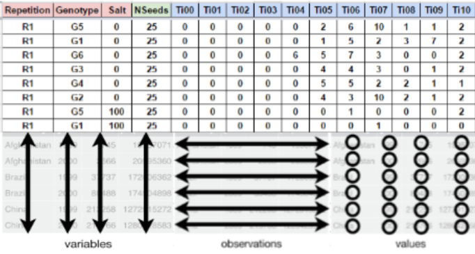

```{r setup, include=FALSE}
source("https://raw.githubusercontent.com/Flavjack/inti/master/pkgdown/favicon/docs.r")
```

# Seed germination process

The physiology and seed technology have provided valuable tools for the production of high quality seed and treatments and storage conditions [@Marcos-Filho1998]. In basic research, the seeds are studied exhaustively, and the approach of its biology is performed to fully exploit the dormancy and germination [@Penfield2009]. An important tool for indicate the performance of a seed lot is the precise quantification of germination through accurate analysis of the cumulative germination data [@Joosen2010]. Time, velocity, homogeneity, uncertainty and synchrony are measurements that inform the dynamics of the germination process. It is interesting not only for physiologists and seed technologists, but also for environmentalists, since it is possible to predict the degree of success of the species, based on the seed crop ability to redistribute germination over time, allowing the recruitment of part of the seedlings formed [@Ranal2006].

# Seed germination indices

```{r}
url <- "https://docs.google.com/spreadsheets/d/1QziIXGOwb8cl3GaARJq6Ez6aU7vND_UHKJnFcAKx0VI/edit#gid=783977038"

url %>% 
  gsheet2tbl() %>% 
kable(caption = "Germination variables evaluated in GerminaR package and limits according to Ranal and Santana (2006), where $n_i$ is the number of seeds germinated in $i^{th}$ time; and $k$ is the last day of the evaluation process for germination")
```

> More info: https://doi.org/10.1111/1440-1703.1275

# Fieldbook preparation

For a correct analysis and fast data processing is important to take into account the data organization and the proper record of the germination process. In this section we will explain how you should collect and organize your data.

## Data organization

For using GerminaR and GerminaQuant is necessary that you have a dataset with germination values. You can use a following data as an example [*"GerminaR"*](https://docs.google.com/spreadsheets/d/1QziIXGOwb8cl3GaARJq6Ez6aU7vND_UHKJnFcAKx0VI/edit?usp=sharing). If you have a Google account you can made a copy of the document and edit it online or download in Excel format for your own analysis.

The fieldbook should have three essential parts.(1) The factor columns (red), according to the experimental design;(2) the seed number column, indicate the number of seeds sown in each experimental unit (green) and (3) the evaluation columns with the germination values (blue). You can design your own field book with different names in the column according your experimental design.

```{r dtorg, fig.cap='Layout for germination evaluation process. The factor column (red) are according the experimental design. The seed number column (green) for the number of seed sown and the evaluation columns (blue) for accounting the germination.',fig.align='center', out.width='100%'}

```

## Data collection

The evaluation of the germination process is obtained of the count of the germination in each experimental unit and It can be evaluated in any time lapse (hours, days, months, etc) in continuous interval of the same length always beginning with the time zero (ei. Ti00), until the end of the germination process or according to the researcher criteria.

# Germination analysis

After the data collection, the information can be processed using GerminaR by the [R console](https://germinar.inkaverse.com/articles/GerminaR) or using the [GerminaQuant](https://germinar.inkaverse.com/articles/GerminaQuant) app. 

# References {-}

<div id="refs"></div>

```{r references}
if(!file.exists("files/pkgs.bib")){write_bib(c(.packages()),'files/pkgs.bib')}
```
